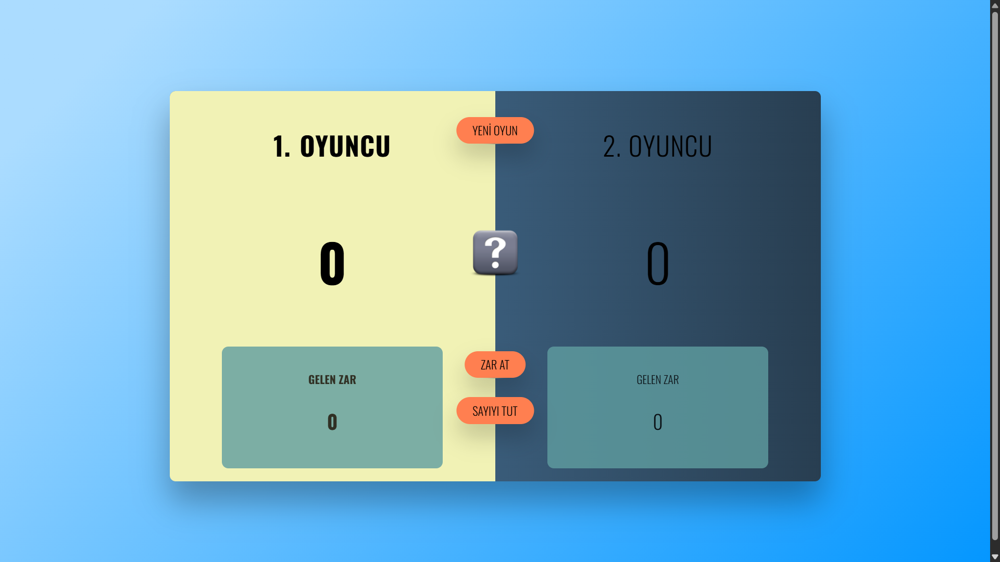
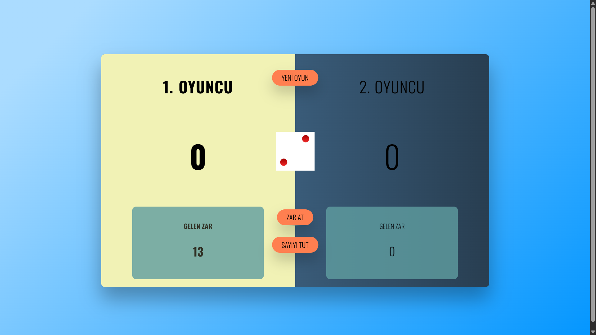
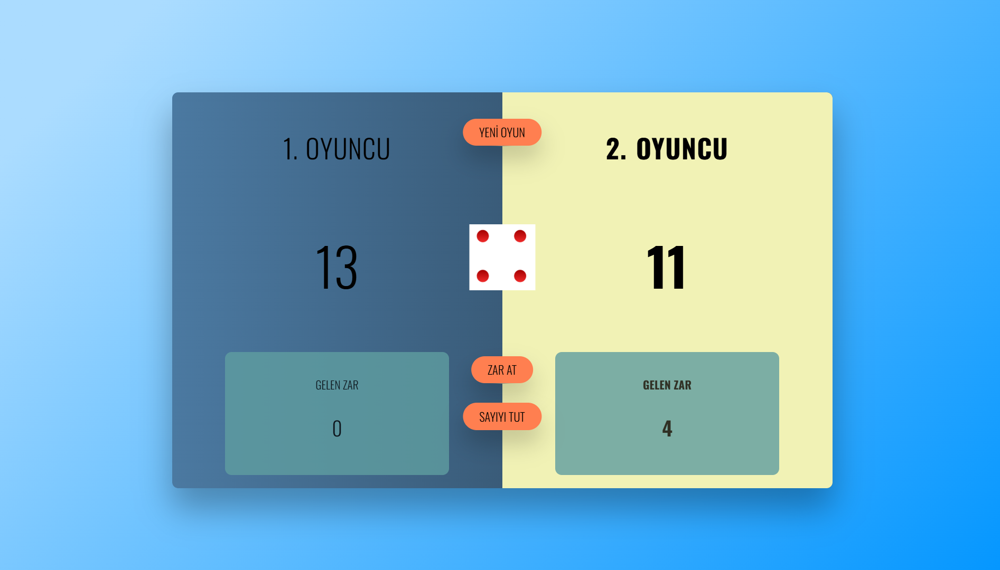
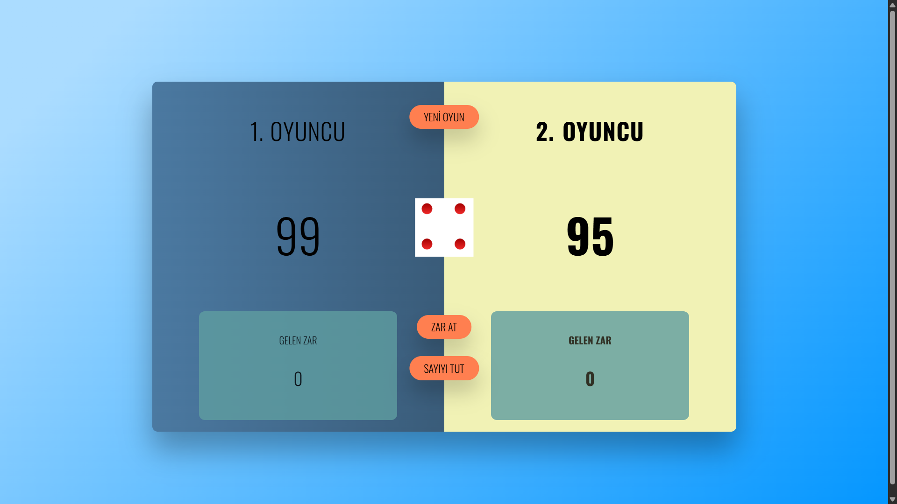
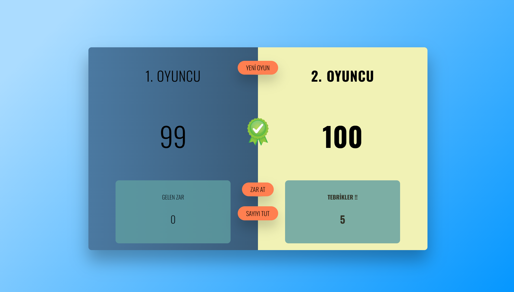

# 🎲 Zar Oyunu (Dice Game)

&#x20;&#x20;

---

## Tanıtım

**Zar Oyunu** klasik "Pig" tarzı iki oyunculu bir web oyunudur. Oyuncular sırayla zar atar, 2–6 arası gelen zarlar o turun geçici puanına eklenir, 1 geldiğinde o turun puanı sıfırlanır ve sıra diğer oyuncuya geçer. Oyuncu istediği zaman **TUT (HOLD)** diyerek o turdaki puanını toplam skoruna ekleyebilir. İlk ulaşan veya geçen oyuncu kazanır.

Bu depo; **statik HTML/CSS/JS** ile yazılmış, anlaşılır yapıda, kolayca genişletilebilen ve GitHub'a yüklemeye uygun bir örnek projedir.

---

## Öne çıkan özellikler

- Basit, anlaşılır oyun akışı ve UI
- Tek dosya yapısına uygun, kolayca entegre edilebilir
- Animate.css ile kazanan animasyonu
- Hedef skor, sesler veya yerel depo ile yüksek skor kaydı eklemeye uygun yapı

---

## Canlı Önizleme

> Yerel olarak test etmek için `index.html` dosyasını tarayıcıda açmanız yeterlidir.

## Ekran Görüntüleri

<p align="center">
  
  
  
  
  
</p>


---

## Kurulum & Çalıştırma

1. Depoyu klonlayın veya ZIP dosyasını indirin.

```bash
git clone <repository-url>
cd zaroyunu
```

2. Statik olarak çalıştırın (tarayıcıda `index.html`):

   - Basitçe `index.html` dosyasını çift tıklayıp açabilirsiniz, veya bir statik sunucu başlatın (bkz. Canlı Önizleme).

3. Geliştirme sırasında canlı yeniden yükleme için Visual Studio Code içinde `Live Server` eklentisini kullanabilirsiniz.

---

## Oyun Kuralları (Adım Adım)

1. Oyun iki oyunculudur: **Oyuncu 1** ve **Oyuncu 2**.
2. Oyuncular sırayla zar atar (`Roll`).
3. Zar 2–6 geldiğinde, o zarın değeri `Current` (o turun puanı) kısmına eklenir.
4. Zar **1** geldiğinde, o turdaki `Current` puan sıfırlanır ve sıra diğer oyuncuya geçer.
5. Oyuncu `Hold` (Tut) butonuna bastığında `Current` puan toplam skoruna (`Score`) eklenir.
6. Eğer bir oyuncunun toplam skoru hedef skoru (varsayılan: **100**) aşarsa veya eşitse, o oyuncu kazanır.
7. `New Game` ile oyun sıfırlanır ve başlangıç durumuna dönülür.

---

## Dosya Yapısı

```
zaroyunu/
├─ index.html             # Oyun arayüzü
├─ script.js              # Oyun mantığı (event handling)
├─ style.css              # Stil ve responsive düzenlemeler
├─ cong.png               # Kazanma görseli
├─ assets/screenshots     # Oyun içi görselleri
├─ dice.png               # Zar genel görseli
└─ dices/                 # Zarın 1..6 görselleri (dice-1..dice-6.png)
```

---

## Kodun Özeti & Ana Fonksiyonlar

Aşağıda proje içindeki önemli fonksiyonların kısa açıklamaları verilmiştir.

### `init()`

- Oyunu başlatır / sıfırlar.
- `scores = [0, 0]`, `currentScore = 0`, `activePlayer = 0`, `playing = true` vb. değişkenleri ayarlar.
- UI elemanlarını (score, current, label) sıfırlar ve önceki animasyon/sınıfları temizler.

### `switchPlayer()`

- Mevcut oyuncunun `current` değerini sıfırlar ve `activePlayer`'ı değiştirir.
- UI'da aktif oyuncu vurgusunu toggle eder.

### `btnRoll` event handler

- `if (!playing) return;` kontrolüyle oyunun bitmesi durumunda işlem yapmaz.
- Rastgele bir zar üretir: `const dice = Math.trunc(Math.random() * 6) + 1;` (adil dağılım).
- Zar görselini `dices/dice-${dice}.png` ile günceller.
- Eğer zar 1 ise `switchPlayer()` çağrılır, değilse `currentScore` güncellenir.
- `diceRolled` flag'ini true yapar ("zar atıldı" bilgisi).

### `btnHold` event handler

- `if (!playing || !diceRolled) return;` ile oyunun bitmesi veya zar atılmadan hold yapılması engellenir.
- `scores[activePlayer] += currentScore;` işleminden sonra skor güncellenir.
- Eğer skor hedefi geçtiyse oyun sonlandırılır (butonlar disabled, animasyon oynatılır), değilse `switchPlayer()` çağrılır.

> Not: `diceRolled` flag'i, kullanıcının zar atmadan `Hold` butonuna basarak puan çalmasını veya mantıksız davranışı önlemek içindir.
